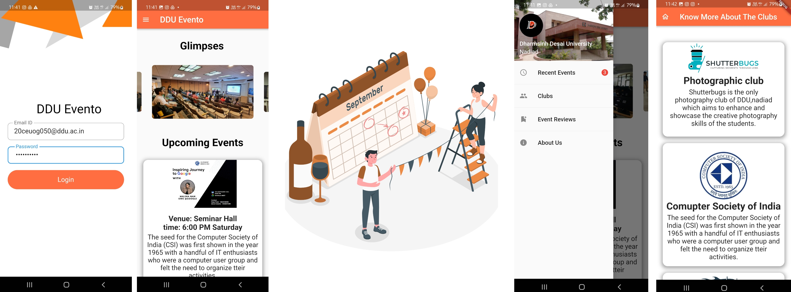

# EventRegisto
Nowadays, clubs have to do many physical efforts to increase the registrations for the particular events and due to tight college schedules, students may be unaware about such events and hence they may not be able to get some important knowledge. Hence, we are here for solutions for both clubs and students! Our main intention to develop this app is to create awareness among the students for every club's event. Using our app, students can see upcoming events of the clubs and if interested then they can register themselves. If some club wants to throw an event then the club head can be able to see availability of resources and according to that they can plan their event.
  

 

### Flutter Event Registration App

### Event Registration App Features
  1) Authentication using ddu id.
  2) can see upcoming events.
  3) can give reviews of past events.
  4) can see details of the clubs.

### Created By:-
1) [Parangi Rathod (CE116)](https://github.com/Parangi-27)
2) [Zenisha Savaliya (CE119)](https://github.com/zenishasavaliya)
